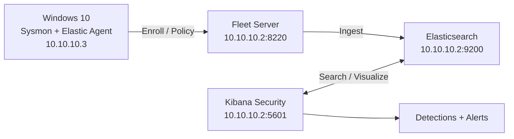

# SOC Detection Lab (Elastic SIEM + Fleet + Sysmon)

<!-- Add this block right under your H1 title -->

I built a small SOC lab that collects endpoint telemetry from Windows using Sysmon, ships it through Elastic Agent + Fleet Server, and generates security alerts using custom detections. I validated detections end-to-end and documented investigation workflow (alert → triage → incident report).

## What this demonstrates
- Telemetry pipeline build: endpoint → Fleet → Elasticsearch → Kibana Security
- Endpoint visibility with Sysmon (process creation + command line + parent process)
- Detection engineering (KQL rules + tuning to reduce noise)
- Alert triage (reading alert fields/JSON, investigation pivots, conclusions)
- Troubleshooting (logs, ports, services, container lifecycle)

## Architecture
See: [ARCHITECTURE.md](ARCHITECTURE.md)

### Diagram (Mermaid)

## Detections
- Encoded PowerShell execution: [detections/01-encoded-powershell.md](detections/01-encoded-powershell.md)
- Local admin group change: [detections/02-local-admin-change.md](detections/02-local-admin-change.md)
- Windows service created (tuned): [detections/03-service-created.md](detections/03-service-created.md)

## MITRE ATT&CK Coverage

| Detection | Technique ID | Tactic | Status |
|---|---|---|---|
| Encoded PowerShell Execution | T1059.001 | Execution | ✅ Detected |
| Local Admin Group Change | T1098 | Persistence | ✅ Detected |
| Windows Service Created | T1543.003 | Persistence | ✅ Detected (tuned) |

[View full ATT&CK Navigator layer →](detections/)

## Incident reports
- INC-0001 (Encoded PowerShell triage): [incidents/INC-0001-encoded-powershell.md](incidents/INC-0001-encoded-powershell.md)

## Troubleshooting notes
See: [TROUBLESHOOTING.md](TROUBLESHOOTING.md)

## Lab notes
This is a lab environment (self-signed certs, `--insecure` used for enrollment). The focus is detection + investigation workflow rather than production hardening.

## What I Learned

- **Telemetry gaps are real** — Sysmon without tuning generates enormous noise. Getting signal/noise right took multiple rule iterations.
- **Fleet enrollment is fragile** — Certificate trust issues caused silent failures. TROUBLESHOOTING.md documents every fix.
- **KQL scope matters** — Scoping rules to specific parent processes cut false positives on the service creation detection by ~80%.
- **Incident writing is a skill** — Structured write-ups (timeline → alert fields → pivot → conclusion) are harder than the detection itself.

## Skills Demonstrated

| Area | Details |
|---|---|
| Telemetry Pipeline | Sysmon → Elastic Agent → Fleet → Elasticsearch |
| Detection Engineering | Custom KQL rules, noise tuning, threshold logic |
| Alert Triage | JSON field reading, investigation pivots, MITRE mapping |
| Incident Reporting | Structured INC write-ups with timeline + conclusion |
| Troubleshooting | Port debugging, certificate trust, container lifecycle |
| Documentation | Architecture diagrams, step-by-step writeups |
